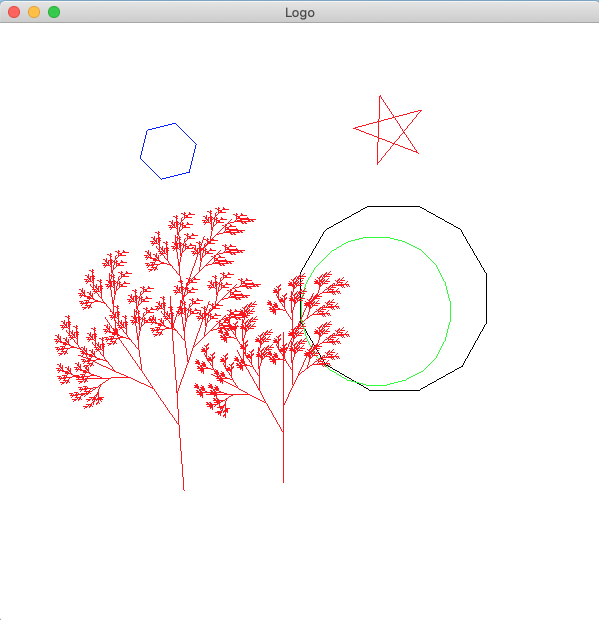
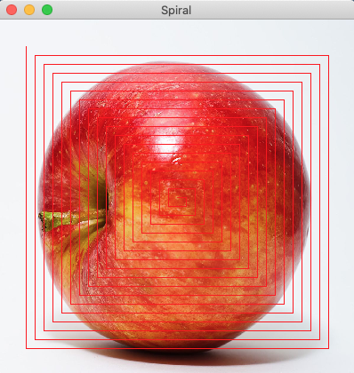

# The ImgUtil library (img_util.dll)

This library features a number of utility functions for drawing simple
2d graphics on a canvas, including features for running simple user-interactive apps that display
images. 

Features for loading and saving images are planned, but not yet implemented.

The library, which is based on SDL2, is portable, 
in the sense that applications built using the library can execute on
Linux, macOS, and Windows using .NET6.0.

NOTICE: A mini-version of the library (with limited functionality) is
available in the `mini/` folder.

## The API

The library API is available in the file [img_util.fsi](img_util.fsi).

## How to build

First install [.NET 6](https://dotnet.microsoft.com/en-us/download/dotnet/6.0) for your
platform.

Then install [SDL2](https://www.libsdl.org/index.php):

  * On **macOS** with homebrew:

        brew install sdl2

  * On **Debian** and **Ubuntu**:

        apt install libsdl2-dev

  * On **Windows** we got you back covered and have added a copy of
    the SDL runtime in the file `SDL2.dll`:

  * On **Arch** (and probably **Manjaro**), `sdl2` is available in `extra`:

        sudo pacman -S sdl2

Finally, compile and run the `turtle` example:

    dotnet run

(To try another example, edit the `img_util.fsproj` file.)

## Examples

A number of examples are available in the `examples` folder. 

The best show-cases for using the library are
- `examples/color_boxes.fsx`
- `examples/keyboard_example.fsx`
- `examples/turtle.fsx`

Note that not all the examples are currently executable. 
## License

MIT license

## Copyright

Copyright 2018-2020 - Martin Elsman

## Contributions

The following individuals have contributed to the ImgUtil library:

- Mads Dyrvig Obitsø Thomsen
- Jan Rolandsen
